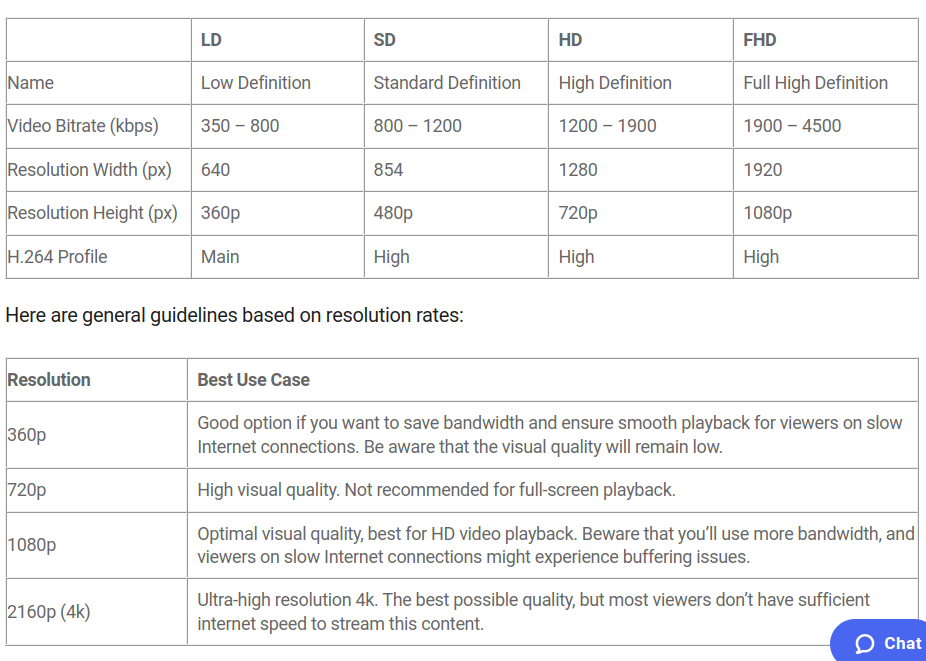

In a nutshell, streaming starts from streamer's computer, to the streaming servers, to the viewer's device.

### How

- Streamer starts the recording

- Recording is encoded (Open Broadcaster Software). YouTube/Twitch have encoding software that enables browser webcam, phone camera to do livestreaming.

- Protocol used:

  - RTMP (Real TimeMessaging Protocol). It is a TCP-based protocol.
  - SRT (Secure Reliable Transport). It seeks to replace RTMP. UDP-based, low latency. However, it is not yet supported by most streaming platforms

- Streaming service connects the streamer to the nearest Point of Presence (PoP) server, using RTMP/SRT.

- From the streaming platform:
  - nearest PoP is selected,
  - stream is segmented/transcoded, and
  - packaged
- The result is a stream with different quality/resolution which is presented to the viewer depending on the quality of their internet.

- Note: segmentation/transcoding is compute-intensive, this is where the stream is segmented in small junks of different quality, and transcoded to different formats in parallel.

- The result of segmentation/transcoding is then packaged into different formats that the video players can understand. Most common livestreaming formats are HLS (Http LiveStream) & DASH.
  - HLS: Most popular. Consists of a manifest file & small video chunks. The manifest file acts a directory to tell the browser/player where all the video files are & where to load the video chunks.
  - DASH (Dynamic Adapted Streaming over Http).
- The resulting HLS/DASH files are cached & distriuted by CDNs to the viewers devices. Latency here is in the range of a few seconds. To further reduce latency, quality can be sacrificed.

- Some platforms provide a `coarse knob`, which lets the streamer to adjust the quality of the stream.

### TCP vs UDP

- TCP: Reliable (guaranteed delivery), packets arrive in order (sequencing of data), comparatively slow

- UDP: Non-reliable (no guaranteed delivery), no sequenced delivery, comparatively faster.

### Media/Data Transport in WebRTC

- Media Stream: Happens over SRTP (Secure Realtime Protocol), RTP (Realtime Protocol), RTCP (Realtime Control Protocol)

- Data Stream: Happens over DTLS (Dataggram Transport Layer Security), SCTP (Stream Control Transport Protocol)

### Resolution Codecs

- Resolutions: 360p, 720p, 1080p, 4k

- Codecs: ABR, DASH, HLS

### Other Terminologies

- Bitrate Video Streaming

- H.264-formatted standard streaming protocol. Also known as MPEG-4 Part 10 or Advanced Video Coding (MPEG-4 AVC)

**Video Encoding**

It is the process of converting RAW video files to digital files so that they are not saved as individual images but fluid videos.

In video editing and production, video encoding is the process of preparing the video for output, where the digital video is encoded to meet proper formats and specifications for recording and playback through the use of video encoder software.

Also called video conversion. It converts a given video input into digital format that is compatible with most types of web players and mobile devices.

**Encoding** It is a way of compressing large video files into more manageable chunks.

**Decoding** Oppoaite of encoding.

**Video Compression** It is using encoding to reduce video size. It happens at camera level. Modern smartphones & most porfessional cameras record video in the [H.264 video codec](https://www.dacast.com/blog/h-264-advanced-video-coding/).
This means as the camera is recording, RAW images from the video sensor encode in real-time, typically using the `H.264 codec`. This compressed (or encoded) video is then recorded to the storage on the camera.

**Encoding Formats** An encoding format is a type of technology used to facilitate the encoding process. It is
made up of codecs & containers.
The encoding format that you use will depend on what’s compatible with both your online video platform and your chosen live stream encoder.

Some of the most popular encoding formats:

```
MP4, FLV, MOV, MKV, LXF, MXF, AVI, WebM, QuickTime
```

**Codecs** Are tools used for video file compression and playback. Usually hardware or software. They compress raw video and audio files between analog and digital formats and make them smaller.

Most common video codec is `H.264`. Others are `MPEG-2, HEVC, VP9, QuickTime & WMV`

**Containers** It is the part of the encoding format that holds together the audio and video codecs and the metadata for the video that is being encoded. The container stores all this information in one file (manifest file)

**Transcoding** It is the process of compressing a video to create multiple renditions of different sizes. It is considered a type encoding. Basically, it is the process of creating copies of video files in different sizes.

Factors to consider when deciding the video file size to serve viewers:

- Time: longer = bigger files

- Resolution (number p pixels): larger = bigger files

- Frame rate: higher = bigger files

- Amount of motion present in the video: more = bigger files

**Adaptive Bitrate Streaming** Also known as variable bitrate streaming. Refers to delivering an appropriate rendition of a video to the viewer based on the strength and speed of their internet connection.

See below image on guide to creating adaptive bitrate streaming:



### Common Video Encoding Challenges

1. Most viewers tend to have slow internet connections. Using analytics, you can determine your viewers location, and depending on average internet speed in that area, serve them with appropriate video quality using adaptive bitrate encoding.

2. Streamer wanting to save on bandwidth. The more often your videos play and the higher their quality, the more bandwidth you will need, and the more money you need to pay service providers. You need to consider which is more important – providing high-quality content to your viewers, or sticking to your budget.

3. Encoded video having larger file size than original video. Remedy to this is to reduce the bitrate.

4. Audio getting out of sync after encoding. This could have something to do with the frame rate of the video. With a tool like [this](https://www.vlchelp.com/find-video-resolution-frame-rate-vlc/), you can chedk the frame rate of your video. If it is unusual, that could cause audio to be out of sync. You can use `Two-pass Encoding` feature of a tool as the one above to solve the issue. Othe causes could be different audio and video lengths.

5. Poor quality of uploaded video. Happens when you choose much lower frame size and bitrate of the target video, in relation to the original video. To get the maximum quality of your videos, be sure to use the original videos attributes in addition to any lower qualities you decide to render the video/stream.

### Recap of Common Terminologies

`Frame Rate`: Number of frames that display per second in a video. The faster the frames flicker along, the more lifelike and immersive the video becomes. The rate at which these still images display is expressed in frames per second (fps). Common frame rates are 24, 25, 30, and 60 fps.

`Bitrate`: Describes how much data a video file contains (measured on a per-second basis). In general, a higher bitrate means better video/audio quality. Bitrates are usually measured in kilobits per second (kbps) or megabits per second (Mbps).

`Video aspect ratio`: Proportional relationship between the width and height of the video. This is usually expressed in the width to height format. For example, most modern television and computer monitors have an aspect ratio of 16:9

`Video resolution`: Number of pixels in a video file. It’s the width and height of the projected image, measured in pixels. For example, a video might have a resolution of 1280 (horizontal pixels) × 720 (vertical pixels). This is usually written as simply 1280×720, or abbreviated to 720p.

`Codec`: A piece of software that compresses raw video and audio files when encoding and encodes or decodes the playback files. Codecs are necessary because video and audio files are very large. Common video codecs are H.264, MPEG-2, DivX, XviD, Theora, VP8, and the WMV family. Common audio codecs are MP3, AAC, Vorbis, and the WMA family.

Remember, codecs do not determine the file’s extension. Rather, that’s the container format. Some of the most popular container formats include MOV (Quicktime), P4, OGG, and AVI.

`Video Encoding`: The process of compressing and changing the format of raw video content to a digital file or format, which will in turn make the video content compatible for different devices and platforms. The main goal of encoding is to compress the content to take up less space.

`Transmuxing`:The process that repackages content files without distorting the content itself. That allows the content to flow more easily between software via the RTMP and HLS protocols.
