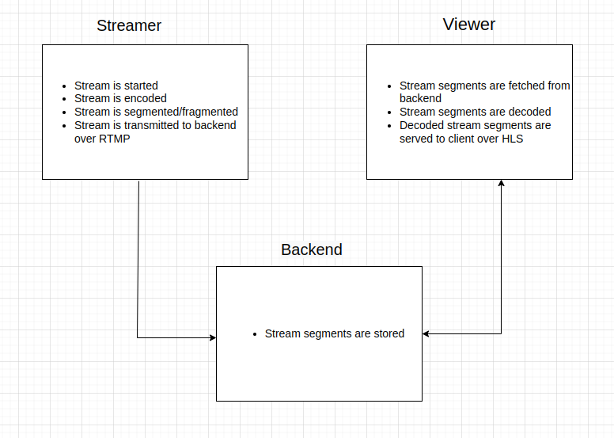

## Proposed System

### Streamer Level

**Technologies Required and Approach**

1. Livestream capture gear. Can be smartphone camera or standalone camera setup.

2. Livestreaming application, capable of encoding livestream and transmit to servers over RTMP. Identified avaliable encoding tools are `ffmgeg`, `OBS`, and `mux video API`. For building a custom application, `ffmpeg` is preferred. It is free and extensible. For quick prototyping, `mux video api` would be ideal.

3. To ensure low latency, `Real-Time Messaging Protocol` (RTMP) is used to ingest encoded digital video files to the storage/distribution servers.

4. To ensure scalability, the livestreaming application should be designed to encode and segment raw livestream feed using parallel encoders for the various video formats. Concurrency is employed to ensure faster encoding and avoid delayed encoding, which increases viewer latency.

### Server/ Backend Level

**Technologies Required and Approach**

1. The server receives digital video files, and processes them. Processing involves segmentation of the files into different video formats. Segmentation requires high compute power. This requires high concurrency in order to accomplish segmentation of livestream in near real time.

2. Containers are created for the segmented livestream files. A container for a particular video/audio format contains a manifest file and small chunks of video files with playback time ranges of between 2 to 10 seconds. The manifest file acts as a directory which keeps a reference for every video files that are ready to be streamed by the viewers.

3. A CDN is crucial to reduce latency on the viewers. The server will serve the livestream to the viewers for the first time, and cache the manifest files on the CDN. On subsequent requests, the viewers requests won't hit the server, but their requests will be serveerd by the CDN.

### Viewer Level

**Technologies Required and Approach**

1. The viewer consumes the livestream over a custom application. The application fetches the live feed from the server using server APIs. The viewer application fetches the manifest file from the server, which has reference to livestream files.

2. Most common protocols used at the viewer level are `HLS` and `MPEG-DASH`. For this application, I will go with `HLS`, because it is supported by moast devices, including Apple devices, unlike `MPEG-DASH` which is not supported by Apple devices.

3. For data streams, which are basically audience interaction with the livestream, `WebRTC` and `Websockets` are the dominant protocols. WebRTC rules over Websockets because of it's high perfomance and high quality streaming. For this application, I will go with `WebRTC`. However, I would go with `Websockets` since we are only using it for data stream. Low latency will not be experienced, and since `WebRTC` uses `Websockets` to establish their connection, I would just want to use `Websockets` and not switch over to another protocol.

### Databases

1. An in-memory datastore like Redis is best for livestream manifest/container files and digital video files. These files need to be accessed as fast as possible by the viewers applications as they contain the data that is being streamed. If the livestream is being stored for later use, the in-momory data will be persisted. If the livestream is not being stored for later use, the in-mory data is safe to be discarded together with livestream.

2. SQL database is the choice for user account data, like usernames, emails, and any other profile data. PostgreSQL is selected here, because it is the preferred database for Elixir projects, and because PosteSQL handles concurrency better than MySQL. The ability to leverage Elixir Ecto changesets with SQL database constraints is another factor why I chose SQL over NoSQL database.

3. Document database like MongoDB is best suited for livestream metadata, like stream duration, video and audio codecs, stream resolutions and other metadata that can be collected from the livestream for analytics and other purposes. MongoDB is my preferred document database here, because of it's built-in aggregation feature, which makes it possible to pull data into a central database providing a single view of the data, and analysis.

**Monitoring database changes**

SQL databases have the functionality to track changes on database level, table level and column level.

You can also leverage database functions to track changes.

Transaction logs can also be used to keep track of database changes.

MongoDB has APIs like `watch()` and `change streams` that help in tracking changes in database transactions.

For both SQL and NoSQL databases, one can leverage timestamps to keep track of database transactions. One can add an entry to every transaction hitting the database to capture the timestamp, which is the time the transaction happended. Timestamp is useful for various reasons, one being the ability to roll back transaction for a particular time range.
