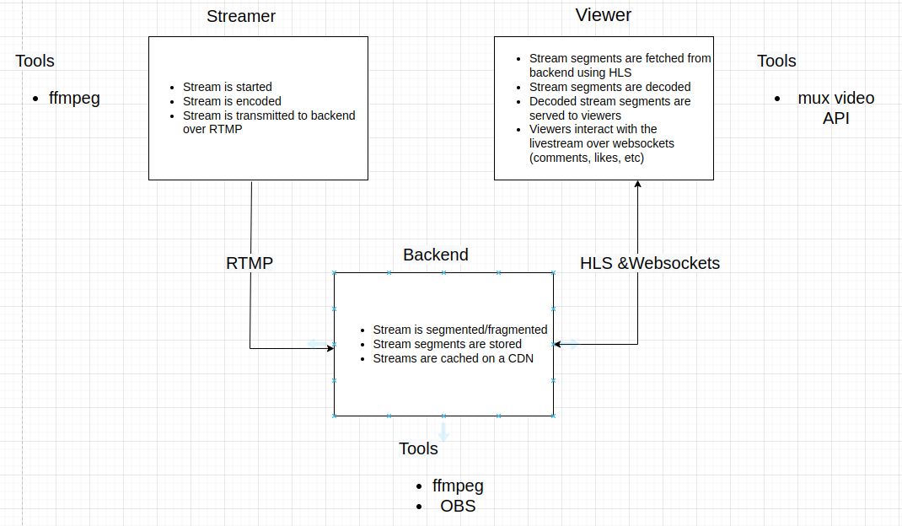

## Proposed System

### Streamer Level

**Technologies Required and Approach**

1. Livestream capture gear. Can be smartphone camera or standalone camera setup.

2. Livestreaming application, capable of encoding livestream and transmit to servers over RTMP. Identified avaliable encoding tools are ffmgeg, OBS, and mux video API. For building a custom application, ffmpeg is preferred. It is free and extensible. For quick prototyping, mux video api would be ideal.

3. To ensure low latency, Real-Time Messaging Protocol (RTMP) is used to ingest encoded digital video files to the storage/distribution servers.

4. To ensure scalability, the livestreaming application should be designed to encode and segment raw livestream feed using parallel encoders for the various video formats. Concurrency is employed to ensure faster encoding and avoid delayed encoding.

### Viewer Level

**Technologies Required and Approach**

1. The viewer consumes the livestream over a custom application. The application fetches the live feed from the server using server APIs.

2. Most common protocols used at the viewer level are `HLS` and `MPEG-DASH`. For this application, I will go with `HLS`, because it is supported by moast devices, including Apple devices, unlike `MPEG-DASH` which is not supported by Apple devices.

3. For data streams, which are basically audience interaction with the livestream, `WebRTC` and `Websockets` are the dominant protocols. WebRTC rules over Websockets because of it's high perfomance and high quality streaming. For this application, I will go with `WebRTC`.

### Databases

1. An in-memroy datastore like Redis or Memcached is best for livestream manifest/container files and digital video files. These files need to be accessed as fast as possible by the viewers applications as they contain the data that is being streamed.

2. SQL database is the choice for user account data, like usernames, emails, and any other profile data. PostgreSQL is selected here.

3. Document database like MongoDB is best suited for livestream metadata, like stream duration, video and audio codecs, stream resolutions and other metadata that can be collected from the livestream for analytics and other purposes. MongoDB is my preferred document database here.
